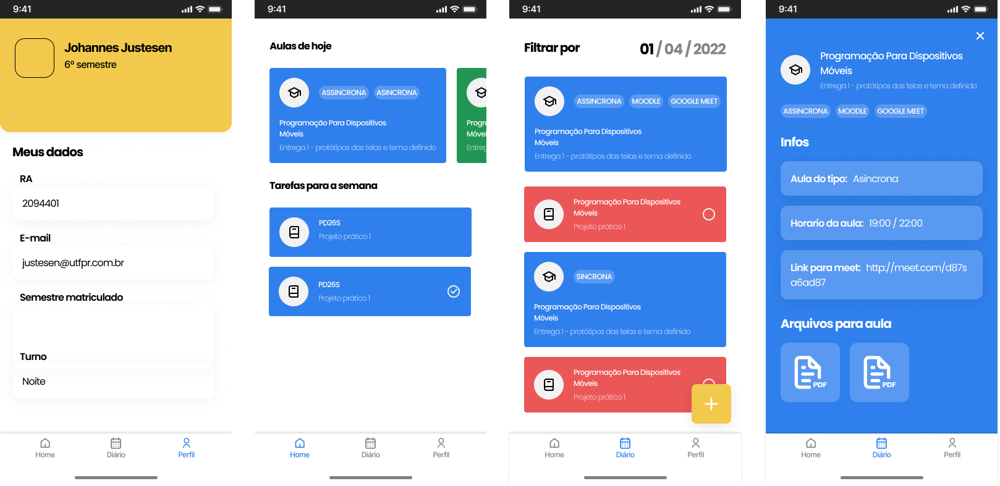

# MobileUTFPR

Project with the objective of exercising knowledge with Firebase and React Native, in order to solve a problem of UTPR students

## Proposal

Currently, with the return of face-to-face classes or the adoption of the hybrid model, the doubt about what the modality of each subject will be in the day-to-day is present. Therefore, our application will have the purpose of being an educational diary, so that through a previous registration of a csv file made by the teacher, it is possible to notify students about how their classes will proceed, as well as how it will be possible to verify the contents. scheduled and link to access remote classes.


<br/>

<br/>

## Tech

- Node.js
- React Native
- Firebase

## Start project

Instal dependencies

```sh
// with yarn
yarn

//with npm 
npm install
```

Start project

```sh
// with yarn
yarn start

//with npm 
npm start
```

## More

if you want to see the prototypes that were used as the basis for the project, follow figma project:


 - ## [Figma Project](https://www.figma.com/file/SihQQxwjYsQ9YwPT9NRZoF/Projeto-de-Mobile?node-id=18%3A241) 
